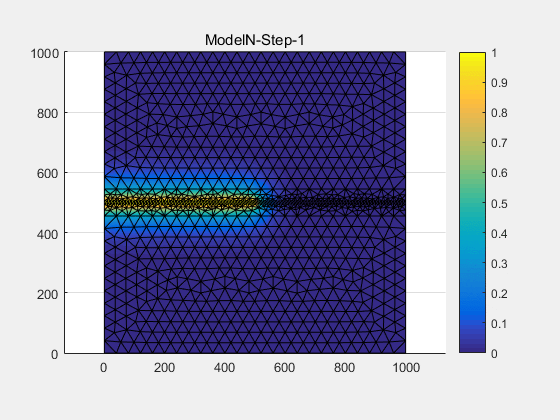
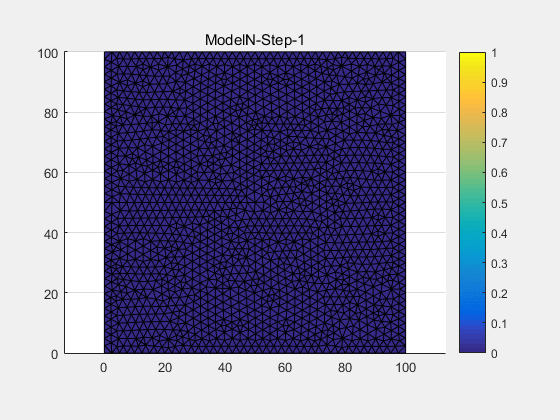
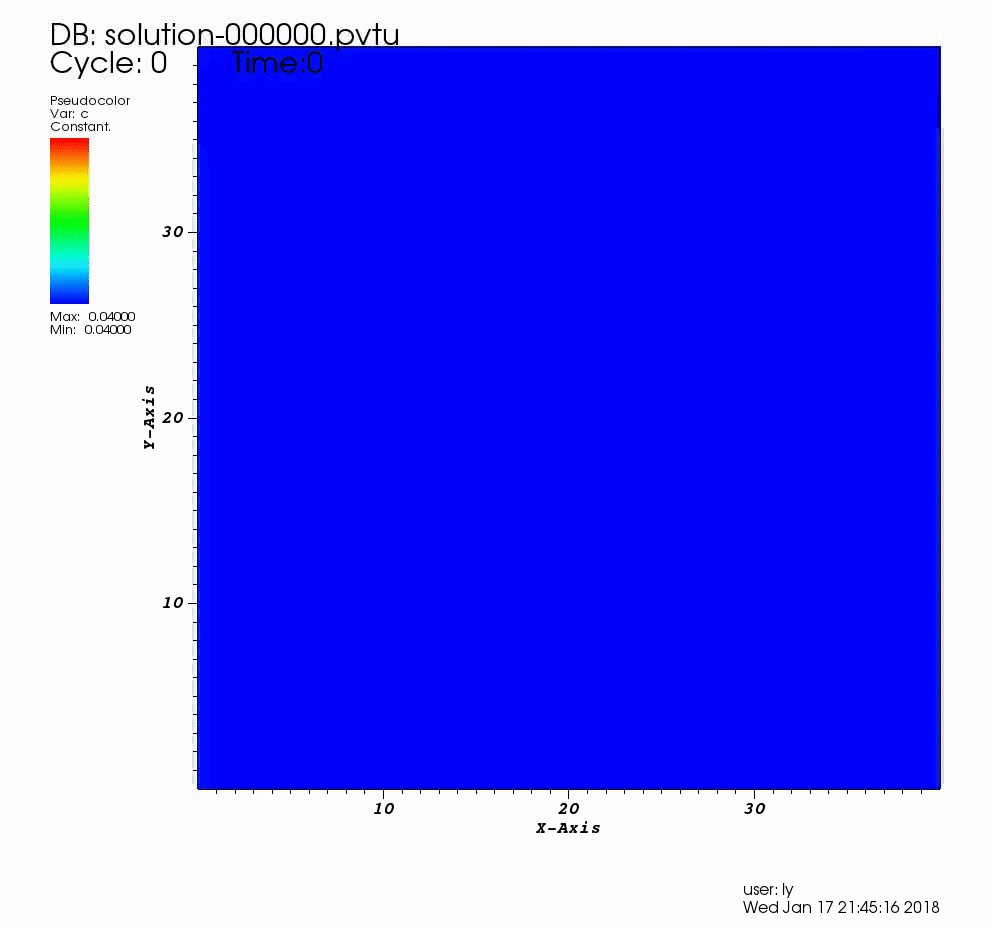

> [download resume](./cv/resume.pdf) (last update: 2019-07-21)

---

## CONTACT

- Email: [lyyc199586@sjtu.edu.cn](mailto:lyyc199586@sjtu.edu.cn)
- Phone: (+86) 152-0192-0867
- Address: 800 Dongchuan Road, Shanghai (200240), CHINA
- GitHub: [lyyc199586](https://github.com/lyyc199586)
- Personal page: [Sharing Room](https://lyyc199586.github.io/)

---

## EDUCATION

### `Sept. 2017 - Present`: UM-SJTU Joint Institute, **Shanghai Jiao Tong University**,  Shanghai, China

_Mater candidate_, **Mechanical Engineering**, advisor: [Yongxing Shen](http://umji.sjtu.edu.cn/~yxshen/En/Content.php?pid=6&cid=122)

- University of Michigan - Shanghai Jiao Tong University Joint Insititute (UM-SJTU JI): JI was jointly established in 2006 by two permier univeristies, the Univeristy of Michigan and Shanghai Jiao Tong University
- GPA: 3.71/4.0
- All courses and activities are held in English

### `Sept. 2013 - July. 2017`: College of Material Science and Engineering, **Jilin University**, Changchun, China

_Bachelor_, **Material Science and Engineering**

- Rank 1/52
- GPA: 92.52/100
- National sholarship (2 times)

---

## RESEARCH

### Graduate research

#### `Sept. 2017 - Present`: Phase field approach to fracture

- Develop a phase field model with a tension - compression discriminant：
  
  We apply the homogenization theory to construct a phase field model, which predicts reasonable crack paths to benchmarks with a well defined tension - compression discriminant.

| tension test                           | shear test                                           |
| -------------------------------------- | ---------------------------------------------------- |
|  |  |

#### `May. 2019 - Present`: Data-driven multiscale simulations of materials

- Use manifold learning approach (locally linear embedding techniques) to interpolate phase field evolution for fracture:
  
  The offline procedure consists of two stages: (1) dataset construction with the phase field analysis for the RVE. (2) data manifold construction with the LLE. The online interpolation procedure then readily delivers the phase field evolution.

| 3-D manifold(1)                             | 3-D manifold(2)                             |
| ------------------------------------------- | ------------------------------------------- |
|  |  |

#### `Nov. 2017 - May. 2018`: Phase field simulation for materials

- Use an open-source phase field modeling framework ([PRISMS-PF](http://prisms-center.github.io/phaseField/)) to do simulations of solidification and precipitation

| concentration field                         | magnitude of displacement                                  |
| ------------------------------------------- | ---------------------------------------------------------- |
|  |  |

### Undergraduate research

#### `Mar. 2017 - June. 2017`: Dynamic phase field approach to fracture

- Learn and develop a finite-element based dynamic phase field program

#### `Nov. 2015 - Mar. 2016`: Undergraduate casting technology design contest

- Design, model and simulate a nodular iron casting
- National 3rd prize

#### `May. 2015 - Mar. 2016`: National undergraduate innovation program

- Prepare and test photocatalytic property of Ce 3+ - doped titanium dioxide nanotubes

---

## AWARDS

`Octo. 2016`: National Scholarship, _Rank 1/52_

`Octo. 2015`: Dongfeng Automobile Scholarship, _Rank 2/296_

`Octo. 2014`: National Scholarship, _Rank 1/296_

---

## LANGUAGE

- Standard English tests
  - GRE General: 325+4 (V155, Q170, AW4)
  - TOEFL: 100 (R29, L25, S23, W23)
  - IELTS: 7.0 (R7, L8, S6, W6)

---

## SKILLS

- Coding
  - Languages: MATLAB > Python > C++
  - Data processing
  - Data visualization

- Editing
  - $\LaTeX$
  - Microsoft Office
  - Markdown

- FEM Analysis
  - CATIA
  - Abaqus

---

## COURSES

- Mathemetics
  - Method of Applied Math
  - Numerical Analysis

- Mechanics
  - Foundation of Solid Mechanics
  - Fundamentals of Solidification

- Engineering
  - Mechanical Vibration
  - Wave Propagation in Elastic Solids
  